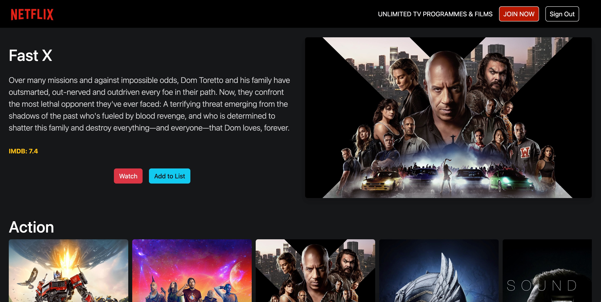
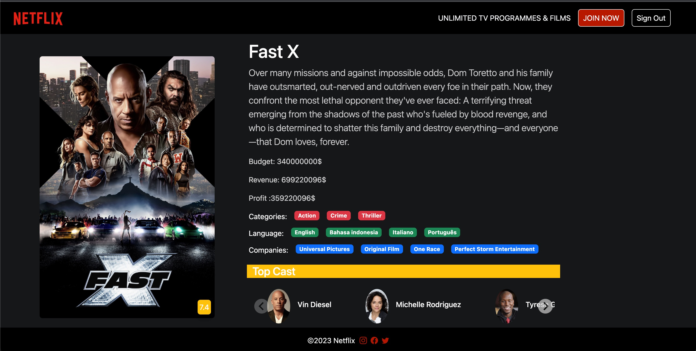

# Netflix Clone

This project is a Netflix clone built using React and Redux. The goal of this project is to recreate the popular streaming platform, Netflix, with features such as movie details and trailers.

## Features

- Movie Catalog: Browse through a vast catalog of movies and TV shows, similar to Netflix's library. Explore different genres, view popular titles, and search for specific movies or TV shows.

- Movie Details: Access detailed information about each movie or TV show, including the title, overview, release date, duration, cast, and more. Dive deeper into the content to make informed viewing decisions.

- Trailers: Watch trailers of movies and TV shows directly on the website. Preview the content and get a glimpse of what to expect before watching.

- User Accounts: Create user accounts, log in, and log out. Enjoy personalized experiences by saving favorites, managing watchlists, and receiving recommendations based on viewing history.

## Technologies Used

- React: A JavaScript library for building user interfaces. It allows for the creation of reusable UI components and facilitates efficient rendering and state management.

- Redux: A predictable state container for JavaScript applications. Redux helps manage the application's state, enabling easier data flow and state management.

- React Router: A library that provides routing capabilities in a React application. It allows for navigation between different pages and enables bookmarking of specific routes.

- API Integration: The project integrates with an API to fetch movie data, including details and trailers. This ensures the availability of up-to-date content.

## Setup

1. Clone the repository and navigate to the project directory.

2. Install dependencies by running the command: `npm install`.

3. Start the development server with the command: `npm start`.

4. Access the website by visiting `http://localhost:3000` in your browser.

## Contributing

Contributions to this project are welcome. If you encounter any issues or have suggestions for improvement, please open an issue or submit a pull request.

## License

This project is licensed under the [MIT License](LICENSE).

## screeShot

 

## screeShot

 

## screenRecording

 
# Redux-Netflix-Clone
# Redux-Netflix-Clone
